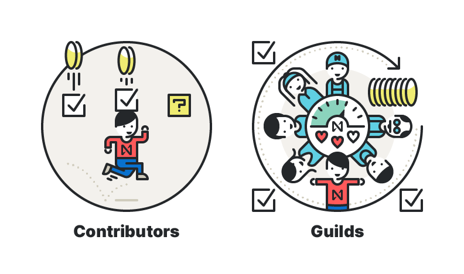

# Программа гильдий в NEAR


[NEAR](https://near.org/) - публичный блокчейн с шардингом на консенсусе Proof of Stake, созданный сильной командой, которая уже создавала единственные в своем роде шардированные базы данных. В NEAR делают акцент на удобстве для разработчиков. Платформа эффективна для решения спектра задач: от безопасного управления активами и удостоверения личности до выполнения высокомасштабируемых децентрализованных приложений. NEAR привносит мощь Open Web в блокчейн.

Вступайте в нашу группу в телеграме [https://t.me/near\_protocol](https://t.me/near_protocol) для получения ответов на вопросы.


[Источник на английском](https://near.org/blog/guild-program-launch/) \|\| [Исходник для редактирования](https://github.com/zavodil/cryptasutra/blob/master/near-protocol/guilds.md)

В начале года была запущена программа контрибуторов для тех участников, которые хотят помогать в продвижении инициатив NEAR. С тех пор участники со всего мира искали способы увеличить вовлечённость, так, например, появились сообщества для поддержки проекта, а[ русскоязычное сообщество NEAR](https://t.me/near_protocol) достигло нескольких сотен активных членов.

Основная цель для [следующих этапов](https://near.org/blog/mainnet-roadmap/) запуска MainNet — это дальнейшая децентрализация протокола. Она включает в себя не только распределение технической мощности, но и расширение сообщества. Команда NEAR хотела бы опираться на опыт своих участников и оказывать им поддержку и вместе приближаться к целям, заложенным в [миссию](https://near.org/blog/the-evolution-of-the-open-web/) NEAR.

#### NEAR объявляет о запуске программы гильдий

Гильдии появились еще в древнем Риме, тогда так назывались группы строителей, производителей или торговцев. Совсем недавно термин перешел в игровой мир, и распространяется на команды игроков, которые объединяются, чтобы поддерживать друг друга в миссиях и квестах. В нашем случае гильдии - это комьюнити-хабы, которые заинтересованы в поддержке открытой экосистемы.

Гильдии представлены лидером гильдии. Программа гильдий предоставляет награды всем членам гильдии, если их работа способствует построению здоровой экосистемы. Награды зависят от таких вещей, как количество активных разработчиков, связанных с гильдией приложений, числа запущенных валидирующих нод, количества рефералов, перешедших в другие программы NEAR,  а также число полученных наград в программе по bug bounty \(поиск багов\).

### Кто может возглавить гильдию? 

Вам нравится идея открытой веб-экосистемы? Возможно, вы в настоящее время уже строите сообщество, или не хотите оставаться в стороне? Возможно, у вас уже есть активное сообщество как часть вашего бизнеса или просто как круг друзей? Гильдии предназначены для блокчейн-энтузиастов, футуристов, желающих создать Прекрасное Будущее, ранних последователей и технических гуру.

Если вы узнали себя, то можете создать новое сообщество или зарегистрировать существующее сообщество в качестве гильдии. Существующая [программа контрибуции](https://near.org/contributor/) ориентирована на индивидуальный вклад и также будет продолжаться. Программа гильдий ориентирована на вклад со стороны сообществ. Если продолжать примеры из игрового мира, то программа контрибуторов - это «Режим одиночной игры», а программа гильдий - «Многопользовательский режим».

### Сотрудничество гильдий

Лидеры гильдий смогут делиться ресурсами с другими гильдиями, чтобы совершенствовать навыки своего сообщества. Это позволит продвинуться глобальному сообществу в целом.

Обмен ресурсами, инициативами и генерация идей будет происходить на онлайн-портале, который следует воспринимать как базу знаний.

Вы можете использовать портал для таких целей как:

* Общение с другими гильдиями и контрибуторами NEAR
* Освещение своих успехов
* Получение вознаграждения за инициативы, которыми вы делитесь
* Получение поддержки сообщества и участие в глобальных инициативах

### Возьмите сообщество в свои руки 

Что это значит? Вкратце: будучи лидером гильдии, вы решаете, как вы хотите сформировать свою гильдию.

* Вы хотите проводить онлайн-встречи? Планируете события с очным посещением? Проводите семинары или приглашаете сторонних докладчиков? 
* Где ваше сообщество будет взаимодействовать? Лично, через Discord или Telegram? 
* Вы хотите сформировать свое сообщество вокруг проекта? Будет ли оно ориентировано на обучение разработчиков или валидаторов? 
* Команда NEAR ожидает, что вы будете делиться своими частными знаниями, инициативами и ресурсами с глобальной командой лидеров гильдий.

### Награды 

Основное убеждение программы гильдий заключается в том, что сообщества NEAR должны быть вознаграждены за вклад в развитие экосистемы. Есть три способа, которыми это происходит в программе гильдий: единоразовые «**Boosts**», текущий рейтинг «**Rolling Rewards**» и классификация «**League**».

**Boosts** \(усиления\) применяются к одноразовым действиям, награды за которые гильдия может требовать в течение фиксированного периода времени. Они сосредоточены вокруг привлечения членов сообщества для участия в экосистеме NEAR. Другие возможные примеры: приглашение людей к другим программам NEAR или к использованию приложений в сети.

**Rolling Rewards** \(повторяющиеся награды\) будут предлагаться в зависимости от здоровья, силы гильдии и вклада её членов. Другими словами, они отражают, насколько вовлечены члены гильдии, насколько они активны в базовых инициативах экосистемы, таких как разработка приложений или запуск нод .Также учитывается число разовых вознаграждений, которое получили за это время участники гильдии.

**League** \(система лиг\) ****представляет собой рейтинг лучших гильдий на основе их роста и эффективности. Активное и растущее сообщество гильдий перейдет в в более высокую лигу и получит награды. Вот начальная структура рейтинга и связанные награды:

| Бронза | Серебро | Золото |
| :--- | :--- | :--- |
| 300 токенов в месяц | 1200 токенов в месяц | 3000 токенов |

Обратите внимание, что количество токенов может со временем меняться . Кроме того, граждане некоторых стран \(например, неаккредитованные инвесторы из числа граждан США и Канады\) могут получать альтернативные вознаграждения, не связанные с токенами.

Со временем в программу гильдий введут дополнительные привилегии. Целью программы является выявление и поощрение сообществ, которые обеспечивают ценность для экосистемы. Таким образом, на пути к цели стимулы будут корректироваться.

### Пример гильдии 

Возьмем для примера вымышленную гильдию, которая привлекает своих членов, проводя образовательные семинары и хакатоны. У них есть активное сообщество в Telegram, где они поддерживают связь друг с другом, и многие из их участников являются разработчиками, которые пишут для NEAR.

Команда разработчиков гильдии выиграла хакатон в этом месяце, и их приложение имело неожиданный успех. Они запускают валидирующую ноду в рамках программы [Stake Wars](https://nodes.cryptasutra.com/near-protocol/stake-wars-episode-2), чтобы поиграть с сетью и научиться пользоваться инструментами.

Данная гильдия может получить следующие вознаграждения в течение одного месяца \(цифры предназначены исключительно для демонстрационных целей и могут не отражать фактическую структуру вознаграждения\):

1.  **Boosts:** 1,720 NEAR
   1.  Награда за месяц: новые рефералы в программу разработчиков: 34  \* 10 NEAR за каждого = 340 N
   2. Награда за месяц: новые участники онлайн-хакатона NEARHacks 15 \* 20 NEAR за каждого = 340 N
   3. Бонус гильдии: дополнительные 5% приза за первое место NEARHacks, присвоенное их команде: 20 000 N \* 5% = 1000 N
   4. Награда в течение нескольких месяцев: участники, впервые пополнившие свой кошелек NEAR: 8 \* 10 NEAR за каждого = 80 N
2.  **Rolling:** 981 NEAR
   1. Текущие активные участники программы разработчиков, связанные с гильдией: 55 \* 10 NEAR за каждого = 550 N 
   2. Бонус за успешные приложения, развернутые членами гильдии: 331 NEAR 
   3. Запуск ноды с 99% времени безотказной работы в BetaNet в рамках программы Stake Wars: 100 N 
3.  **League:** 1,200 NEAR
   1. Серебро: На основании наград за предыдущий месяц \(Boost 1680 NEAR и Rolling 445 NEAR,\) гильдия заняла 9-е место в рейтинге гильдий и, таким образом, заработала бонус в 1200 N в этом месяце

ИТОГО: 3901 NEAR

### С чего начать

Подайте заявку, чтобы стать лидером гильдии. Если вас выберут, то следующими шагами станет:

* Приглашение на портал для контрибуторов NEAR
* Ссылка на ресурсы, которые помогут вам начать

Вы хотите создать свою собственную гильдию и стать частью нашей глобальной сети? [Отправьте заявку](https://nearprotocol1001.typeform.com/to/l1PT1k).

