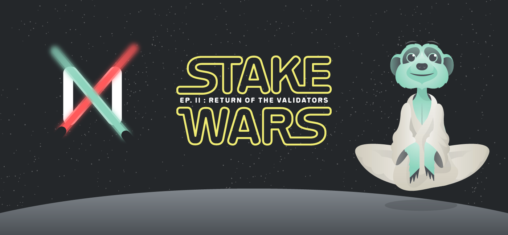

# Stake Wars: Часть II

  
MainNet NEAR недавно запустился в своей первой фазе «POA» \(см. [roadmap](https://near.ai/mainnet-roadmap)\), а это означает, что командой разработчиков было запущено небольшое количество валидирующих нод. Чтобы перейти к следующему этапу, «MainNet: Restricted», управление сетью должно будет передано большой группе валидаторов, запустивших ноды.

Цель Stake Wars: Часть II состоит в том, чтобы подключить этих валидаторов, протестировать стабильность системы и начать внедрять систему делегирования NEAR и подготовиться к следующему этапу запуска MainNet.

Stake Wars: Часть I произошла в конце 2019 года как способ стресс-тестирования сети. Это помогло выявить ключевые области для улучшения стабильности и способствовало улучшению процессов запуска. Мы надеемся, что Часть II будет также полезна для повышения стабильности системы, но, кроме того, речь идет о том, чтобы ускорить работу новых и старых валидаторов, чтобы они могли сразу запустить стейкинг при запуске MainNet: Restricted.

В этой статье будут обсуждаться уникальные возможности валидации и делегирования в NEAR, показано, как будут работать Stake Wars: Часть II, и будут описаны награды за успешное участие.

### Делегирование на основе смрат-контрактов

Одна из ключевых функций, предлагаемых NEAR, которая отличает ее от многих сетей Proof-of-Stake, - это делегирование на основе контракта.

«Делегирование» - это когда один владелец токена передает свои токены проверяющему узлу, чтобы использовать их от имени делегатора. Это важно, потому что не каждый захочет или сможет запустить валидирующую ноду. Хотя минимальные требования для запуска такого узла не являются технически сложными, тут потребуются операционные усилия. Они заключаются в обеспечении одновременного развертывания обновлений с другими валидаторами; и создание надежной инфраструктуры, оптимизированной для безотказной работы и безопасности. Поскольку эти требования могут требовать профессионального уровня исполнения и финансовых затрат, обычные обладатели токенов обычно предпочитают этим не заниматься.

Другие протоколы обычно реализуют делегирование на уровне протокола, что означает, что оно одинаково для всех валидаторов. Валидаторы, как правило, конкурируют друг с другом, основываясь исключительно на том, какую цену они предлагают - например, если протокол предоставляет 5% вознаграждение за валидацию, эти валидаторы могут предоставить 4% от этого в качестве возврата людям, которые делегируют им, а 1% оставить себе. Как правило, это приводит к ценовой войне, где единственное различие между валидаторами заключается в том, какую отдачу они предлагают, и репутационных факторах, таких как количество людей, уже делегировавших им. Кроме того, централизованные биржи часто занимают значительную долю рынка делегирования, поскольку они позволяют предлагать дополнительные финансовые инструменты, которые обычные валидаторы не могут предоставить.

Поскольку делегирование в NEAR осуществляется через смапрт-контракты, оно гораздо более гибкое. Каждый валидатор теоретически может создать свой собственный контракт на делегирование и настроить параметры доступа к контракту для предоставления широкого спектра услуг. Например, один валидатор может предложить делегатам лучшие доходы, если они заблокируют свои токены на длительный период времени, тогда как другой может предложить лучший доход для вкладов крупного размера.

Такое делегирование основанное на контрактах облегчает объединение компонентов [Open Finance,](https://near.org/blog/the-evolution-of-the-open-web/) поэтому возможно существование контрактов, которые динамически распределяют средства делегатов на протоколы лендинга или валидирования в зависимости от преобладающих процентных ставок и доходности на рынке. По сути, стейкинг становится ключевым компонентом экосистемы открытых финансов, обеспечивая при этом, как и предполагалось, безопасность всей системы.

### Как работает делегирование 

Делегирование в NEAR осуществляется путем перевода средств на счет валидатора через безопасный, не требующий доверия смарт-контракт. На [Github ](https://github.com/near/initial-contracts/tree/master/staking-pool)теперь доступна [примерная реализация](https://github.com/near/initial-contracts/tree/master/staking-pool) такого умного контракта, который мы рекомендуем вам изучить, чтобы лучше понять механизм делегирования.

Со временем ожидается, что валидаторы развернут больше функций таких контрактов, как, например, оптимизация налогообложения для разных стран, распределение токенов для обеспечения лучшей ликвидности для валидаторов и делегаторов или любая из ранее описанных стратегий оптимизации дохода.

Делегирование во время Stake Wars: Часть II будет происходить посредством прямого взаимодействия с этими контрактами с помощью инструментов командной строки, но в будущем исследователи и кошельки будут поддерживать пользовательский интерфейс поверх этого инструментария, чтобы облегчить участие менее технически-подкованных пользователей. \(посмотрите [пример кода](https://github.com/near-examples/delegation-app) и [пошаговое видео](https://www.youtube.com/watch?v=u0gVIVS2o4s), если вы хотите встроить его в свой кошелек / проводник / инструмент\).

## Роль валидатора 

Валидаторы являются важными участниками сети NEAR. Как уже упоминалось, они обеспечивают основную работу сети, обеспечивая безопасность и участвуя в техническом управлении. Они запускают узлы, которые генерируют новые блоки, и играют важную роль в развертывании технических обновлений и патчей в своих системах, координируя работу с командой разработчиков NEAR и другими валидаторами. Их мнение может быть услышано напрямую через механизмы технического управления \(governance\), а также участия в процессах голосования, которые поддерживают другие области сетевого управления.

Во время развертывания MainNet валидаторы играют особенно важную роль, потому что их право голоса будет определять, когда разблокируются переводы и [MainNet официально вступит в свою заключительную стадию](https://near.org/blog/near-mainnet-genesis/), перейдя под управление сообществом.

Хотя некоторые валидаторы могут участвовать только со своим собственным стейком \(например, если у них достаточно изначально выделеных токенов\), многие из них являются профессиональными валидаторами, которые полагаются на поддержку делегаторов для получения достаточного стейка и участия в валидации  на ранних этапах. Таким образом, для того, чтобы заслужить доверие будущих делегатов, важно, чтобы такие валидаторы были заметными и громкими в сообществе.

В первые дни существования MainNet минимальная ставка, необходимая для того, чтобы стать валидатором, будет достаточно высока, потому что общее количество «мест», доступных для валидации, определяется количеством шардов, на которые была разбита сеть. NEAR изначально содержит один шард на 100 мест. По мере роста использования NEAR количество шардов также будет расти, а вместе с ним и число мест для валидаторов.

Ожидается, что раз при первоначальном развертывании MainNet будет доступно 100 мест для валидатора, то для одного места в MainNet потребовалось 1-4 миллиона токенов NEAR. Это определяется общим распределением поставленных токенов \(см. подробности  в [блоге «Экономика»](https://near.org/blog/near-protocol-economics/)\). Для ясности, токены, которые валидатор предлагает для валидации, являются суммой их собственных токенов и тех токенов, которые были им делегированы, поэтому для многих валидаторов очень важно добиться достаточного баланса для попадания в число валидирующих нод.

В дальнейшие месяцы станет доступно большее количество мест за счет роста количества шардов, а также будет выпущена функция повышения безопасности за счет так называемых «скрытых валидаторов». Это предоставит еще больше возможностей для валидаторов участвовать в работе сети, накладывая меньше требований к капиталу.

Stake Wars будет проходить в сети [BetaNet](https://explorer.betanet.near.org/), а не в MainNet, поэтому он использует собственные токены тестовой сети BetaNet, которые выделяются участникам при регистрации. Валидаторы, которые еще не подали свои заявки, могут создать свою учетную запись, настроить свой узел и начать участвовать в валидировании. Этот вариант довольно довольно популярен, было получено уже более 180 заявок от предыдущего этапа Stake Wars. Еще до объявления на запуске второй части Stake Wars работало более 60 валидаторов и 100 нод.

Изначально участникам Stake Wars будет выдано 75 000 токенов BetaNet $ NEAR \(это **НЕ** токены MainNet\). Однако если кампания окажется популярной, то и этой сумма может оказаться недостаточно для получения одного места, поэтому важность делегирование еще более возрастет. Кроме того, чтобы освободить место для заинтересованных сторон, мы будем работать над тем, чтобы запустить Stake Wars: Часть II в нескольких тестовых сетях \(см. подробности ниже\).

### Путь к MainNet, управляемому сообществу

Общая цель состоит в том, чтобы валидаторы и владельцы токенов взяли на себя техническое управление MainNet \(для получения более подробной информации см. [MainNet Roadmap](https://near.org/blog/mainnet-roadmap/)\). Чтобы добиться этого и нужны Stake Wars - это возможность определить лучших валидаторов и для них перейти от BetaNet к TestNet, а затем и к MainNet, чтобы предоставить возможность привлекать в делегирования средства участников сети.

Каждый валидатор пройдет через эти фазы:

1. Участие в Stake Wars на BetaNet 
2. Успешное завершение задач валидаторов BetaNet
3. Получение повышения в TestNet
4. Успешное завершение задач валидаторов TestNet
5. Начало стейкинга и приема делигация в MainNet
6. Голосование за разблокировку переводов в MainNet

Присоединяйтесь к Stake Wars на BetaNet 

Командам, которые будут переходить из одной сети в другую, будет предложено забрать токены из стейкинга и сосредоточиться на новой сети. Этот процесс освободит место для новых участников в Stake Wars в BetaNet и будет постепенно увеличивать количество валидаторов, работающих в MainNet.


Примечание: каждое вознаграждение будет проходить индивидуальную оценку и контроль KYC, чтобы препятствовать любым накруткам и совершению любых автоматизированных действий, чтобы отсечь участников, не заинтересованных в запуске узла в MainNet.


Для получения более подробной информации о различиях между BetaNet и TestNet ознакомьтесь с последним разделом [блога Roadmap MainNet](https://near.org/blog/mainnet-roadmap/).

### Критерии оценки и награды

Один из главных критериев определения успеха работы валидатора - это безопасная и работающая инфраструктура. Это означает создание инфраструктуры для обновления программного обеспечения, настройку «горячей» замены оборудования, чтобы поддерживать время безотказной работы \(NEAR обладает уникальной способностью атомарно [переносить стейкинг](https://github.com/nearprotocol/docs/issues/341) между разными нодами\). Кроме того, речь идет об участии в обсуждениях, помощи другим членам сообщества и привлечении большего количества делегаций.

В список лидеров будут включены валидаторы на основе следующих характеристик:

* Uptime \(время безотказной работы\)
* Возможность обновлять узел и внимательно следить за последними обновлениями
* Правильное размещение контракта о делегировании 
* Участие в общественных дискуссиях и помощь другим участникам
* Создание инструментов с открытым исходным кодом и другой вклад в создание кода

Новый список лидеров будет опубликован в репозитории Stake Wars на [Github](https://github.com/nearprotocol/stakewars/blob/master/LEADERBOARD.md). Некоторые параметры оценки будут озвучены в случае необходимости.

Основная награда за успешное участие в Stake Wars: Часть II заключается в том, что лучшие операторы нод будут включены в качестве начального набора валидаторов MainNet. Это делает их первыми управляющими сети и лидерами в сообществе, что очень полезно для привлечения делегирования со стороны других держателей токенов по всей экосистеме.

Более того, поскольку у «MainNet Restricted» не существует инфляции, то для того, чтобы покрыть затраты и мотивировать работу, такие валидаторы будут получать 10 000 $NEAR в месяц.

Stake Wars: Часть II - это динамичная программа, которая со временем будет развиваться. В её рамках будут пройдены усложняющиеся испытания в BetaNet и далее в TestNet. Заданиями для валидаторов будут хард-форки, незапланированные перезапуски, развертывание новых нод, обновления контрактов на делегирование и следование рекомендациям по их поддержанию инфраструктуры. Каждый две недели будут публиковаться новые задачи, решение которых будет открывать новые награды, в том числе возможность официального приглашения стать валидатором в TestNet и затем в MainNet.

Призовой фонд для награды за испытания составление 1 миллион токенов NEAR, выделенных NEAR Foundation для участников этой инициативы.

### Консультативный совет валидаторов

Мы также запускаем Консультативный совет по валидаторов - группу отобранных профессиональных валидаторов, которые со временем получат ключевые голосами в техническом управлении сообществом.

Эти валидаторы участвуют в групповых обсуждениях, советах и ​​отзывах о продуктах, тестировании бета-версий и предлагают функции, которые поддерживают другие валидаторы и экосистему в целом.

Первоначальные члены этого совета были первыми участниками, которые начали запускать узлы валидаторов в BetaNet, помогая коллективу NEAR с техническими деталями валидации и поддерживая других валидаторов в настройке всего. В дальнейшем эта группа будет оставаться в во главе инициатив NEAR в области стейкинга,  создавая необходимые инструменты и обеспечивая обратную связь.

Первоначальными членами этого Консультативного совета валидаторов являются:  [Bison Trails](https://bisontrails.co/), [Buildlinks](https://buildlinks.org/), [Figment Networks](https://figment.network/), [HashQuark](http://hashquark.io/), [Sparkpool ](https://www.sparkpool.com/)и [Staked](http://staked.us/).

В совете все еще есть несколько свободных мест. Если вы являетесь профессиональным валидатором, участвующим в Stake Wars, и хотите присоединиться к этой группе, свяжитесь с командой NEAR.

### Как присоединиться к Stake Wars: Часть II 

Вот несколько шагов, который надо сделать:

1. Изучить официальную страницу инициативы по адресу [https://near.org/stakewars/](https://near.org/stakewars/)
2. Если вы этого еще не сделали, вы должны зарегистрироваться на веб-сайте NEAR BetaNet Wallet [по этой ссылке](https://wallet.betanet.near.org/). Вы сразу получите тестовые токенов, необходимые для развертывания контракта на делегирование. 
3. Если вы этого еще не сделали, вам необходимо зарегистрироваться в программе Stake Wars, используя [эту форму](https://forms.gle/VfM3BcKSeXJhRzpj7), чтобы подписаться на наш технический бюллетень и получать информацию о новых релизах. 
4. Следуйте указаниям на Github по адресу [https://github.com/nearprotocol/stakewars](https://github.com/nearprotocol/stakewars), чтобы развернуть свой собственный узел и добавить его в список VALIDATORS.md.
5. Разверните [смарт-контракт стейкинг-пула](https://github.com/near/initial-contracts/tree/master/staking-pool), чтобы разрешить делегирование на вашей ноде. 
6. После развертывания контракта вы получите дополнительные токены, но, в отличие от прошлых недель, токены будут представлены в вклада делегирования и не будут доступны в вашем кошельке.
7. Присоединяйтесь к официальным каналам сообщества Discord или Telegram и следите за всеми еженедельными обновлениями или необходимыми действиями \(например, обновляйте свою ноду до новой версии\) 

Операторы нод, которые уже запустили свои узлы в BetaNet, должны будут всего лишь развернуть [смарт-контракт стейкинг-пула](https://github.com/near/initial-contracts/tree/master/staking-pool) и соответствующим образом обновить файл VALIDATORS.md на Github.

NEAR Stake Wars ждет вас!

